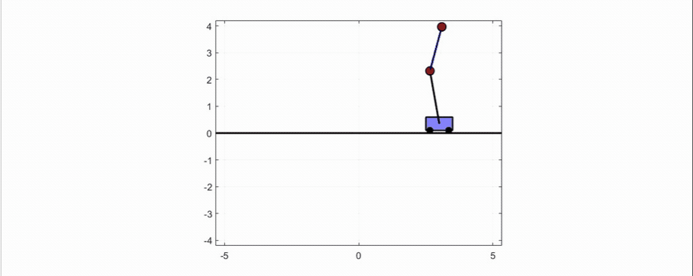

# EE 502
This is a collection of documents for Multivariable Linear Control (EE 502), Fall 2022 at Washington State Univeristy. This includes MATLAB simulations, lecture notes, and code for my inverted pendulum demo which I have built at home.

## Inverted Pendulum Demo
I built a real-life inverted pendulum on a cart demo in my apartment to show off some of the control schemes that we studied in EE 502. This will include a P, PD, PI, PID, Lead, Lag, Lead/Lag, and LQR controller. 
- [P controller test 1](https://youtube.com/shorts/P7Pfby2YItQ)
- [P controller test 2](https://youtu.be/ivcoI8oz12Q)

## MATLAB Simulations
MATLAB code is included to showcase different control schemes for the single and double pendulum on a cart systems, such as the following:

